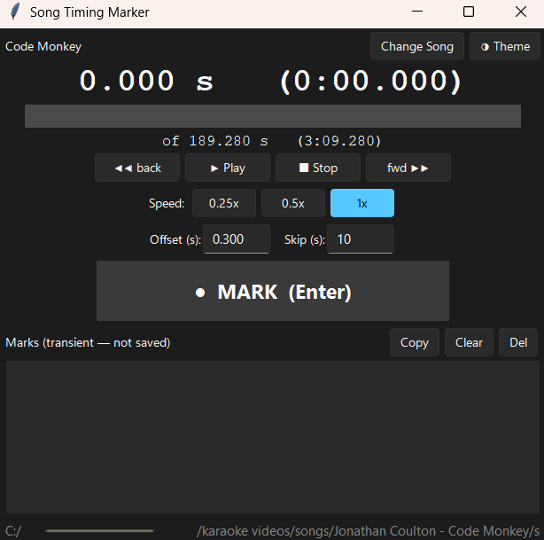
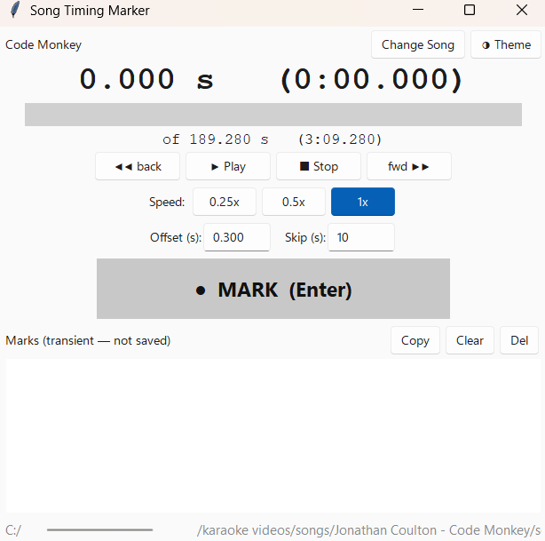
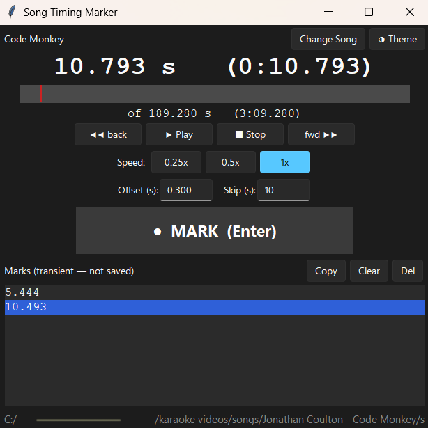

# GUI and Design Notes

Each part of the interface, and the design choices behind them, are described in this document. See the [main README](../README.md#song-timing-marker) for installation instructions and a feature summary.

**Contents**

- [Getting started](#getting-started)
- [Interface](#interface)
- [Marks, Offset, and Latency](#marks-offset-and-latency)
- [Slow Playback](#slow-playback)
- [Design Choices](#design-choices)
- [Testing](#testing)
- [Scope and Future Work](#scope-and-future-work)
- [macOS and Linux launchers](#macos-and-linux-launchers)

## Getting started

On launch the tool opens a file dialog to choose a song. The dialog can be skipped by starting the app with a path already in hand: pass one on the command line (`python main.py "path/to/song.flac"`), drop a file onto `run.bat`, or open an audio file with the tool if it is set as the handler. Once a song loads, the main window appears.

## Interface

<p align="center"><em>
Home screen after selecting an audio file, dark and light themes shown
</em></p>

<p align="center">
  
  
</p>

The window is a single column of controls. Buttons can be clicked or the [keyboard shortcuts](../README.md#keyboard-shortcuts) can be used. From top to bottom:

- **Song label and Change Song:**
  - The header shows `Artist - Title` read from the file's metadata, falling back to the filename if tags cannot be read.
  - The Change Song button swaps the audio file. It clears the current marks only on a successful load.
- **Theme toggle:**
  - A light/dark toggle.
- **Position readout:**
  - A large three-decimal seconds value, with an `m:ss.mmm` companion.
  - It reflects the audible position (see [Marks, Offset, and Latency](#marks-offset-and-latency)), so the number matches what is being heard.
  - Total file duration is displayed below the seek bar.
- **Seek bar:**
  - Click or drag to jump.
  - Hovering shows an `m:ss` tooltip for coarse navigation.
- **Transport:**
  - Back, Play/Pause, Stop, and Forward.
  - The skip amount is set by the Skip field.
- **Speed:**
  - `0.25x`, `0.5x`, and `1x`, with the active speed highlighted.
  - Slow speeds are pitch-preserving (see [Slow Playback](#slow-playback)).
- **Offset and Skip fields:**
  - Offset is the reaction-delay bias applied to every mark.
  - Skip is the step size for back and forward skip buttons.
- **MARK button:**
  - Records timestamp at current audio position, populates Marks section below.
  - Flashes with each press to indicate a recording.
- **Marks list:**
  - The captured timestamps, newest at the bottom. Non-editable by design.
  - A Copy button copies them all (one per line); selecting rows and pressing Ctrl+C copies just the selection.
  - All timestamps can be removed with the Clear button, and selected timestamps can be removed with the Del button.
- **Path footer:**
  - The full path of the loaded file, along the bottom.

## Marks, Offset, and Latency

A mark records `position - offset`, rounded to three decimals, clamped at zero.
The math lives in [`marks.py`](../marks.py) and is pure and unit-tested.

<p align="center">
  
</p>

*Paused at a recorded timestamp: the mark is 0.3 s before the current playback position, which is the effect of the default offset.*

---

Two deliberate ideas sit behind that simple formula:

The offset is a reaction-delay knob. People press the key a fraction of a second after they hear the word, and for karaoke a mark landing slightly early is the desired feel, so the offset (adjustable, defaults to 0.3 s) biases every mark early to absorb both. It is intentionally not precise: a conservative value is fine, even preferred.

Marks also reflect what you hear rather than the buffer. The audio you hear lags the playback cursor by the output stream's latency, because the cursor advances as samples are handed to the device, a fraction of a second before they reach the speakers. Left uncorrected, a small offset could make marks land after the word. The engine subtracts the stream's actual output latency when the cursor came from playback (not from a manual seek), so a mark lands on the word that was heard and the offset stays a pure human-reaction knob, independent of the audio device. The readout and playhead show this same audible position, so the visible gap between the readout and a mark is exactly the offset.

## Slow Playback

Slowing audio without dropping the pitch requires time-stretching, not just
playing samples at a lower rate. The tool uses 
[`audiotsm`](https://audiotsm.readthedocs.io/en/latest/) 
(a pure-Python WSOLA implementation) for this.

- **Pre-computed in the background:**
  - When a slow speed is selected, the stretch is computed on a background thread so the interface never freezes.
  - While it runs, a small progress bar fills next to the speed buttons and Play is disabled. 
  - When it finishes, playback resumes at the new speed from the same position.
- **Cached per ratio:**
  - A song whose file is 100 MB or smaller keeps slowed buffers cached, so toggling between `0.25x` and `0.5x` is instant after the first computation of each.
  - Larger files keep only the active ratio to bound memory. Changing songs releases the cache, as does closing the window.
- **Marks stay in true song time:**
  - The stretched buffer is an internal playback detail: the cursor and position stay in the original song's time base, so a mark taken at `0.5x` records the real timestamp, not a scaled one.
  - The mapping between the two time bases is a small, unit-tested function in [`player.py`](../player.py).

The older pitch-dropping approach (playing at a scaled samplerate) is kept in the code behind a flag, so it can be restored without a rewrite. The code can then be adjusted and the tool used without **audiostm**, which is no longer maintained.

## Design choices

- **Audio engine: [`sounddevice`](https://python-sounddevice.readthedocs.io/) + [`soundfile`](https://python-soundfile.readthedocs.io/):**
  - Decoded samples are streamed through a `sounddevice` callback while a frame cursor is kept by hand, so the position is `cursor / samplerate`, sample-accurate with no polling lag.
  - Both libraries ship pure-Python wheels that bundle their native libraries, which is what keeps the tool self-contained.
- **Timing math lives outside the GUI:**
  - The mark math, the cursor and time-mapping math, and the seek-bar and format helpers are all pure functions, unit-tested headlessly.
  - The audio-device layer and the [Tkinter](https://docs.python.org/3/library/tkinter.html) widgets are thin shells verified by running the app. This split is why a small tool has a meaningful test suite.
- **Look: Tkinter with [`ttk`](https://docs.python.org/3/library/tkinter.ttk.html) + [`sv-ttk`](https://github.com/rdbende/Sun-Valley-ttk-theme):**
  - The Sun Valley theme gives a modern light/dark appearance across platforms, and themed `ttk` widgets sidestep the places where plain Tk widgets render poorly.
  - Named fonts are used instead of hard-coded families so text renders well off Windows.
- **DPI awareness:**
  - On Windows the process declares itself DPI-aware at startup, so the app and its file dialog render crisply on high-DPI displays instead of being bitmap-scaled.
  - The call is guarded so it is a no-op elsewhere.

## Testing

Run the suite with:

```
python -m pytest
```

The pure logic (mark math, cursor and time-stretch mapping, seek-bar and format
helpers, the playback-speed state machine) is covered by unit tests that need no
audio device. The audio callbacks, the background stretch, and the Tkinter
widgets are hand-verified: their behaviour is checked by running the app, since
their correctness is about real audio and real rendering.

## Scope and future work

*Noted areas of possible improvement.*

- **Cross-platform testing:**
  - Draft macOS and Linux launchers are provided [below](#macos-and-linux-launchers), and the code targets portability, but only Windows is built and tested here. 
  - Real testing on macOS and Linux hardware is left to users and contributors.
- **Higher-quality or real-time time-stretch:**
  - An external library such as rubberband, or a streaming stretch, could be used if `audiotsm`'s quality or its first-use compute latency ever becomes limiting.
- **Speed-aware offset:**
  - Automatically scaling the reaction-delay offset to the current playback speed, since perception differs at `0.5x` and `0.25x`.

Out of scope, by choice:

- **Awareness of the karaoke timing-file format:**
  - The tool deliberately knows nothing about words or destination files/formats. It plays audio and emits numbers; the marks are read and copied by hand.
  - Reading a word list or writing marks back to a file would couple it to one external format, which the current transient-marks approach avoids.

## macOS and Linux launchers

Windows has `run.bat`. The equivalent launchers for macOS and Linux are not yet
built or tested here, but the following drafts are a reasonable starting point.
Each assumes the virtual environment lives in `.venv` beside the script and
forwards a single dropped or opened file path (quoted) to the app.

**macOS:** save as `run.command`, then make it executable once with
`chmod +x run.command`. Double-clicking launches it through Terminal.

```bash
#!/bin/bash
cd "$(dirname "$0")"
source .venv/bin/activate
exec python main.py "$@"
```

**Linux:** save as `run.sh`, then `chmod +x run.sh`. Whether a double-click runs it depends on the desktop environment; running it from a terminal always works.
Tkinter may need a system package first, e.g. `sudo apt install python3-tk` on
Debian/Ubuntu.

```bash
#!/usr/bin/env bash
cd "$(dirname "$0")"
source .venv/bin/activate
exec python main.py "$@"
```
